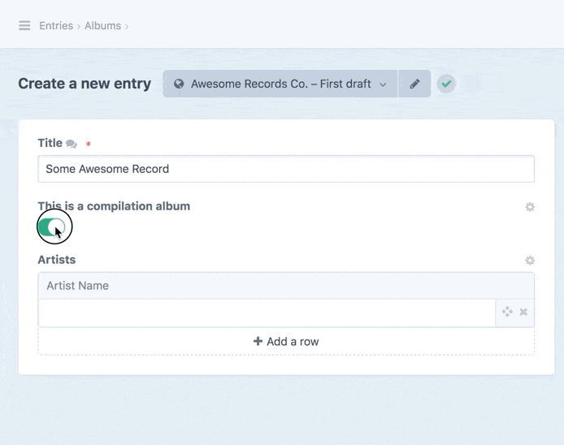
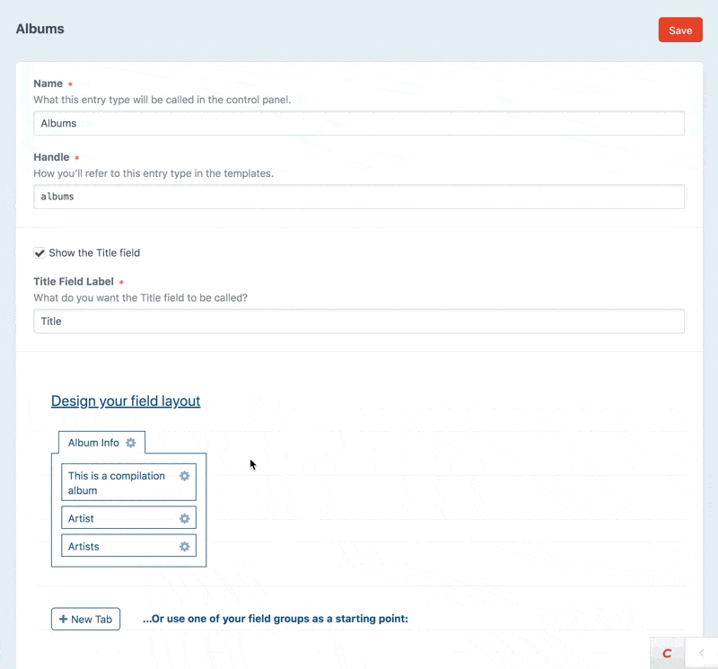

# Update May 2022: REASONS IS RETIRED

Field layout conditionals is finally a core feature as of Craft 4.0 (released in May 2022)! ...which means you no longer need this plugin :)    

**Reasons has been retired and the plugin will not be updated to work with Craft 4**, although I'll still make sure it keeps working for any upcoming Craft 3.x releases.  

**Before upgrading your site to Craft 4, make sure to note down any conditionals that you'll want to re-create using the core feature, before uninstalling Reasons and Composer-removing it.**

_______

# Reasons plugin for Craft CMS 3.x  

_Supercharge your field layouts with conditionals._  

### What is Reasons?

Reasons adds simple conditionals to field layouts in Craft CMS – making it possible to hide or show fields on the fly, as content is being edited.  

  

### Changes from the Craft 2 version:  

* Supports [Project Config](https://docs.craftcms.com/v3/project-config.html)  
* Works with the new Drafts and Live Preview systems, and the new Asset edit pages in Craft 3.4  
* Support for plugins (including third party fieldtypes, Craft Commerce and Solspace Calendar) has been *removed*  

## Requirements

**This plugin requires Craft CMS 3.7.0 or later. It does not work with Craft 4.0 or newer.**

[Looking for the Craft 2 version?](https://github.com/mmikkel/Reasons-Craft)

## Installation

To install the plugin, follow these instructions.

1. Open your terminal and go to your Craft project:

        cd /path/to/project

2. Then tell Composer to load the plugin:

        composer require mmikkel/reasons

3. In the Control Panel, go to Settings → Plugins and click the “Install” button for Reasons.

## Updating from Craft 2

Existing conditionals in the database from the Craft 2 version should be migrated over automatically and continue to work as-is. Note that all third-party fieldtype and plugin support (including Solspace Calendar and Craft Commerce) has been removed, though.  

## Using Reasons

To create or edit conditionals for a particular field, edit the field layout for the appropriate element source (i.e. the Entry Type, Category Group, Global Set or Asset volume). Click the little cogwheel next to the field in the field layout designer and choose _Edit conditionals_.  

Note that for element sources that support tabbed field layouts, Reasons is designed to work on a "per-tab" basis.  

  

### What's a "toggle field"?

A _toggle field_ in Reasons is a field that can be used to "toggle" other fields (in the same field layout tab) on or off (show or hide them, as it were).  

These field types can be used as toggle fields:  

* Lightswitch
* Dropdown
* Checkboxes
* Multi-select
* Radio Buttons
* Number
* Plain Text
* Entries
* Categories
* Tags
* Assets
* Users

### Where does it work?

Reasons works for Entries, Global Sets, Categories, Assets, Users and Tags. It also works inside Live Preview, in element editor modals and for entry drafts and revisions.  

### A note on required fields

Be careful not to add conditionals to a required field. Even if the required field is hidden, it'll still be _required_ by Craft, potentially making your content impossible to save.  

### What Reasons doesn't do - or a disclaimer of sorts

It's important to realize that Reasons is strictly about increasing authoring experience, by hiding the UI for fields that might be irrelevant based on other fields' current values.  
 
Reasons works as a thin layer on top of Craft's Control Panel UI, using JavaScript to show and hide fields as content is being edited. Since the plugin is dependant on undocumented features, markup, CSS and JavaScript in the Control Panel, it's basically a big hack and may stop working at any time if certain aspects of the Control Panel is ever changed or redesigned.  

The good news is that Reasons does absolutely nothing to your content, nor does it affect your fields or field layouts in any way. It also does absolutely nothing on the front end of your site. And if you ever uninstall it, your field layouts will simply render natively, i.e. with all fields visible regardless of their values.  

My advice is to be smart about how you design your field layouts; always keep in mind that the layouts may render without conditionals one day. Use Reasons sparingly and with caution – if you find yourself creating a lot of complex conditionals, consider alternative approaches (e.g. Entry Types or Matrix fields).  
